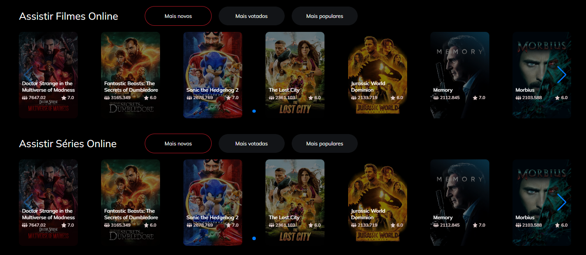
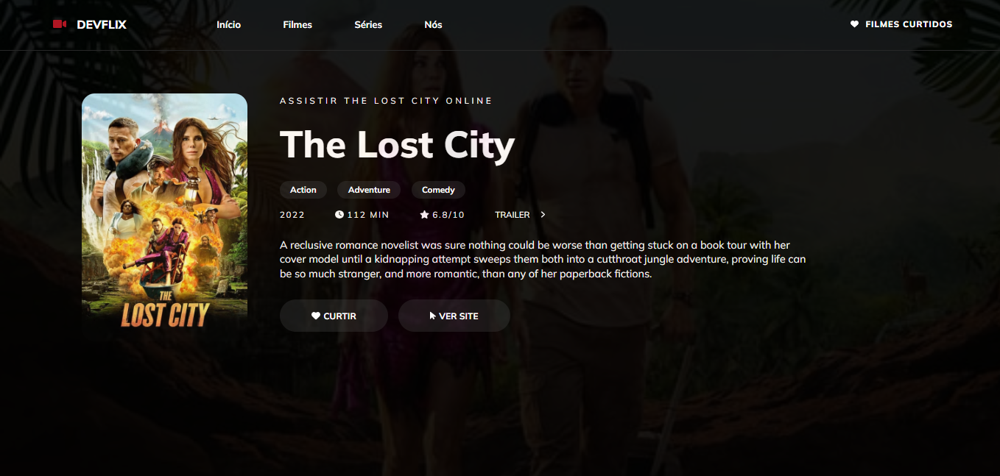
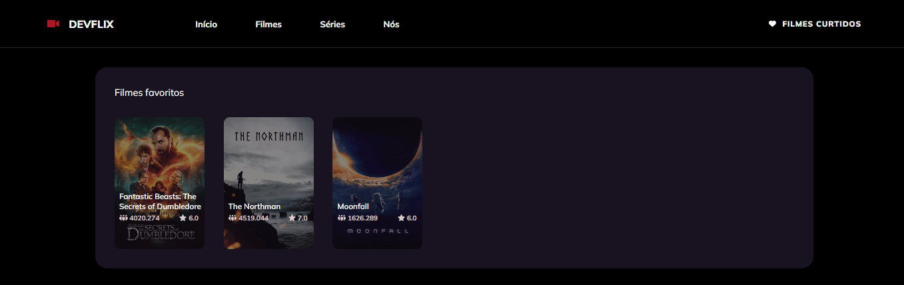

# DEVFLIX 





>  O projeto DevFlix é um site que aborda alguns filmes consumidos de uma API.

Confira a aplicação: https://devflix.netlify.app/ <br>

## :page_facing_up: Explicação

O projeto consiste num site onde estão dispostos filmes e suas informações, como bilheteria, descrição, nome, imagens do filme, popularidade, duração do filme e gêneros.

## 📁 Componentes

**Home:** nesse componente é feita a página inicial do projeto e é onde estão dispostos os filmes com algumas opções de filtragem. </br>
**Favorites:** nesse componente está uma tela com todas os filmes que o usuário favoritou. As informações são guardadas no localStorage. </br>
**InspectMovie:** nesse componente é onde está todas as informações de cada filme de acordo com seu ID. </br>
**Loading:** nesse componente está um loading para uso durante a aplicação. </br>
**Header:** nesse componente está o cabeçalho do site. </br>
 
## 📁 Views

O site tem no total 4 views, sendo elas:

- **Home** 
- **Favorites** 
- **InspectMovie** 
- **NotFound** 
## :dart: Etapas ##

- [x] Instalação das dependências
- [x] Página Home 
- [x] Header e implementação dos routers-links
- [x] Consumo da API
- [x] Listando filmes da API no Carrossel
- [x] Criação Página de Inspeção de filme
- [x] Resgate do ID do produto pela URL e listando informações do filme
- [x] Opção de curtir e descurtir o filme e guardando informação no localStorage
- [x] Página Favoritos
- [x] Resgate dos filmes favoritos no localStorage
- [x] Página NotFound 

## :rocket: Tecnologias ##

No projeto foram utilizadas as seguintes tecnologias:

- [VueJs](https://vuejs.org/)
- [Vue Router](https://router.vuejs.org/)
- [SASS](https://sass-lang.com/)
- [Font Awesome](https://fontawesome.com/)
- [Vite](https://vitejs.dev/)
- [Axios](https://www.npmjs.com/package/axios)
- [Swiper](https://swiperjs.com/)

## :closed_book: Requisitos ##

Antes de iniciar :checkered_flag:, você precisa ter [Git](https://git-scm.com) e [Node](https://nodejs.org/en/) instalados.

## :checkered_flag: Começando ##

```bash
# Clone this project
$ git clone https://github.com/jguilhermesl/devflix
# Access
$ cd devflix
# Install dependencies
$ yarn or npm 
# Run the project
$ yarn start or npm start 
# The server will initialize in the <http://localhost:3000>
```
## 🤝 Colaboradores

Agradecemos às seguintes pessoas que contribuíram para este projeto:

<table>
  <tr>
    <td align="center">
      <a href="#">
        <br>
          <sub>
            <b>João Guilherme</b>
          </sub>
        </a>
      </td>
  </tr>
</table>

<a href="#top">Volte para o topo</a>
